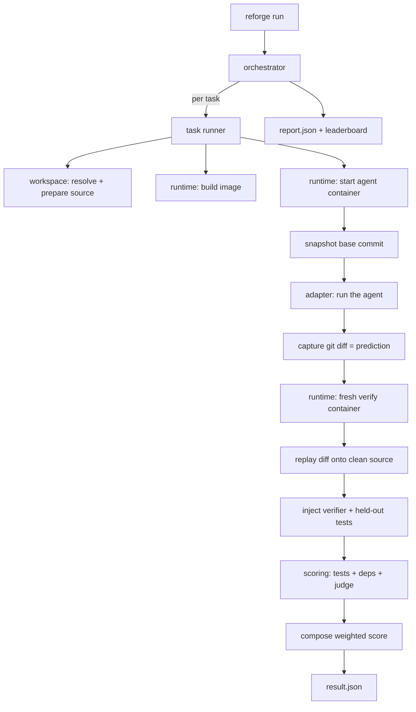
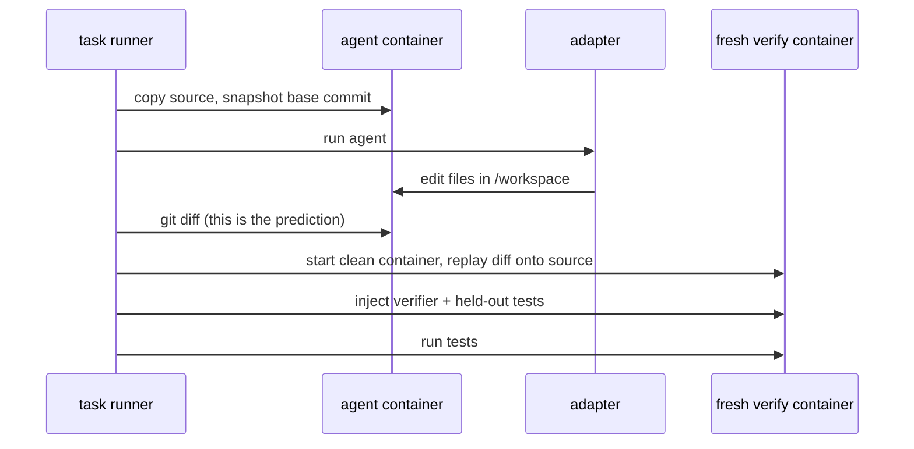
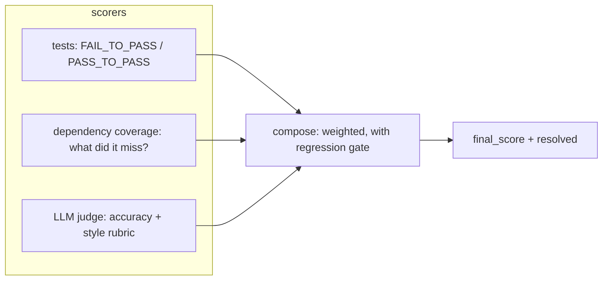

# Architecture

reforge runs an agent against a task in an isolated container, captures what it
changed, and scores it. This document explains how the pieces fit together and why
the boundaries fall where they do.

## The shape of a run

## Layers

Each layer has one job and talks to the next through a small interface. Nothing
reaches around a layer to touch Docker or the model directly.

| Package | Responsibility |
| --- | --- |
| `spec` | Parse and validate a task directory into a `TaskSpec`. |
| `dataset` | Load collections of tasks (a local dir, or `hf:owner/repo` from HuggingFace). |
| `workspace` | Resolve the source code (git, local, tarball) and prepare a clean copy. |
| `runtime` | Build images, run containers, exec commands, copy files, and set up an egress proxy when a task allowlists hosts. |
| `adapters` | Drive one agent inside a container. Pluggable via entry points. |
| `runner` | Run a single task's lifecycle, and orchestrate a whole dataset. |
| `scoring` | Turn a finished run into sub-scores and a final score. |
| `report` | Aggregate results, add confidence intervals and pass@k, and render them. |

## How the harness stays honest

Two rules keep an agent from gaming its own score.

First, the diff is captured before any test material exists, so the agent never
sees the tests it will be graded against and the tests never land in the diff.

Second, verification runs in a **fresh container**, not the one the agent worked
in. The agent had root in its own container, so it could have shimmed the test
runner, dropped a `sitecustomize.py` on the path, or pre-written the report. None
of that survives: reforge starts a clean container from the task image, replays
only the captured diff onto a clean copy of the source, and runs the tests there.
A passing score can therefore only come from the diff actually solving the task.

## Scoring

Three scorers run against the finished container and compose into one number.

- **tests** is the backbone and follows SWE-bench: the tests that should now pass
  do, and nothing that used to pass broke.
- **dependency coverage** compares the dependencies a correct solution needs
  against what the agent actually wired up, and names what it missed.
- **judge** scores the fuzzier questions with a rubric.

Weights are per task and are normalized over whichever scorers ran, so turning the
judge off simply reweights the rest. A `pass_to_pass` regression zeroes the score
regardless of the other numbers.

## Isolation

Every task runs in its own container: no network by default, all capabilities
dropped, `no-new-privileges`, and CPU/memory/PID limits from the task spec. The
source is always a copy, and the Docker socket is never mounted into a task
container.

A task that needs the network for only a few hosts can set
`environment.allowed_hosts`. reforge then puts the task on an internal-only network
whose sole route out is a small filtering proxy, so the task reaches those hosts and
nothing else. See [SECURITY.md](../SECURITY.md).

## Reproducibility

Each run records its provenance in `run.json` and each `result.json`: the tool
version, adapter version, image digest, and resolved source ref. Pinning task
sources to a commit SHA and running with `--no-judge` gives a fully deterministic
result.
