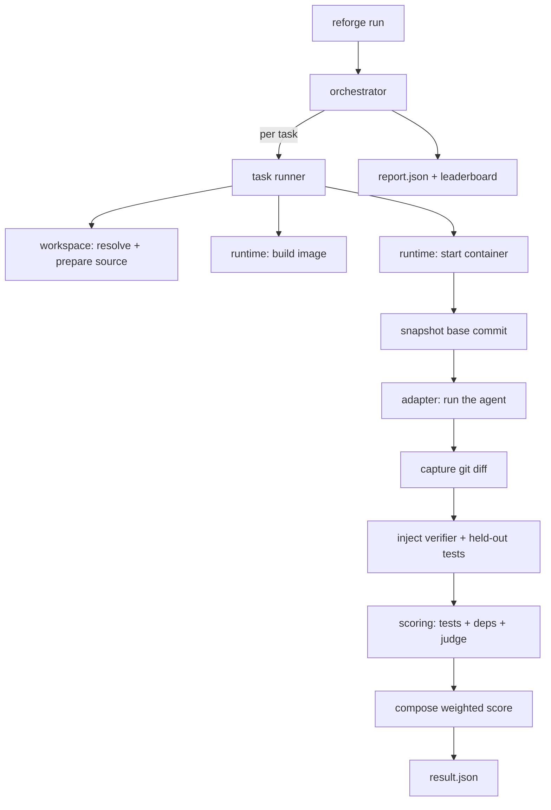
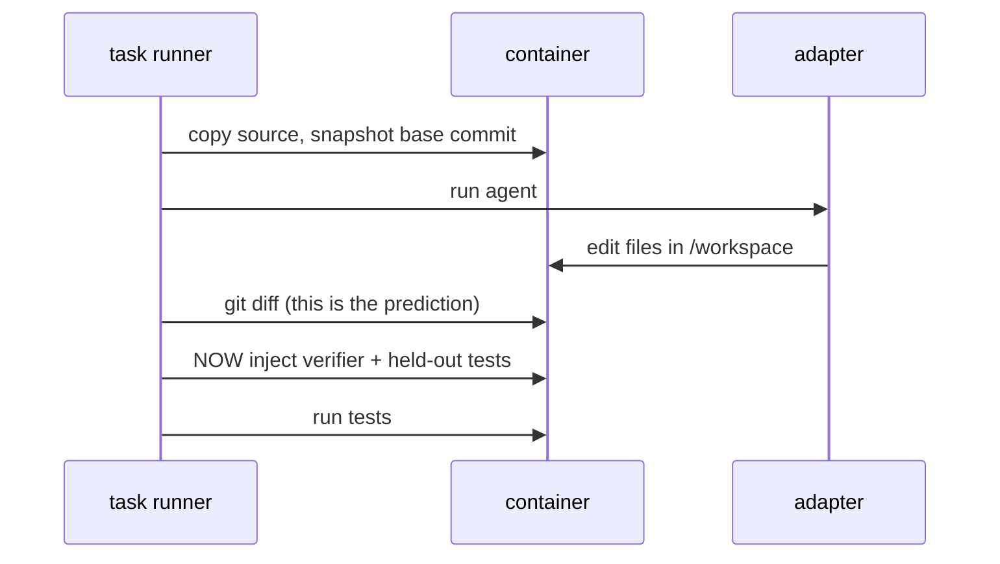
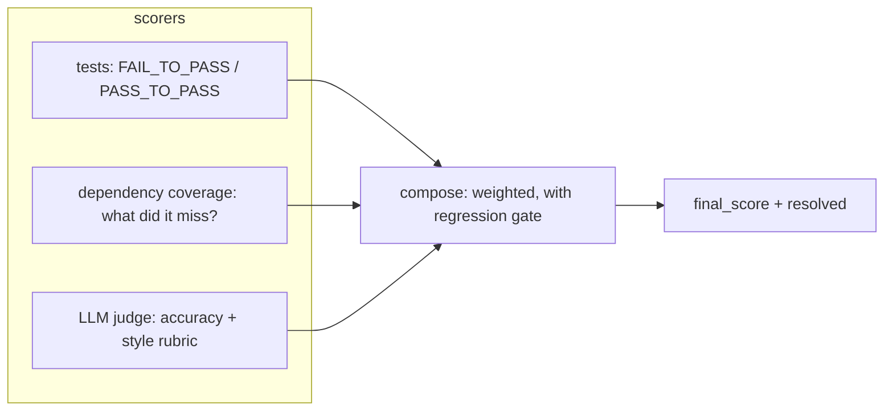

# Architecture

reforge runs an agent against a task in an isolated container, captures what it
changed, and scores it. This document explains how the pieces fit together and why
the boundaries fall where they do.

## The shape of a run

## Layers

Each layer has one job and talks to the next through a small interface. Nothing
reaches around a layer to touch Docker or the model directly.

| Package | Responsibility |
| --- | --- |
| `spec` | Parse and validate a task directory into a `TaskSpec`. |
| `dataset` | Load collections of tasks (local dirs today, HuggingFace later). |
| `workspace` | Resolve the source code (git, local, tarball) and prepare a clean copy. |
| `runtime` | Build images, run containers, exec commands, copy files. |
| `adapters` | Drive one agent inside a container. Pluggable via entry points. |
| `runner` | Run a single task's lifecycle, and orchestrate a whole dataset. |
| `scoring` | Turn a finished run into sub-scores and a final score. |
| `report` | Aggregate results and render them. |

## Why the diff is captured before the tests appear

The single most important ordering rule in the harness:

The agent never sees the tests it will be graded against, and the tests never end
up in the captured diff. This is what stops a task from being gamed by an agent
that edits or deletes the tests.

## Scoring

Three scorers run against the finished container and compose into one number.

- **tests** is the backbone and follows SWE-bench: the tests that should now pass
  do, and nothing that used to pass broke.
- **dependency coverage** compares the dependencies a correct solution needs
  against what the agent actually wired up, and names what it missed.
- **judge** scores the fuzzier questions with a rubric.

Weights are per task and are normalized over whichever scorers ran, so turning the
judge off simply reweights the rest. A `pass_to_pass` regression zeroes the score
regardless of the other numbers.

## Isolation

Every task runs in its own container: no network by default, all capabilities
dropped, `no-new-privileges`, and CPU/memory/PID limits from the task spec. The
source is always a copy, and the Docker socket is never mounted into a task
container. See [SECURITY.md](../SECURITY.md).

## Reproducibility

Each run records its provenance in `run.json` and each `result.json`: the tool
version, adapter version, image digest, and resolved source ref. Pinning task
sources to a commit SHA and running with `--no-judge` gives a fully deterministic
result.
